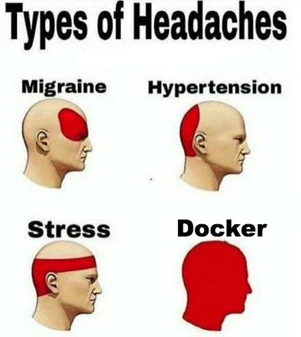

# TP1 : Containers

Dans ce TP on va aborder plusieurs points autour de la conteneurisation : 

- Docker et son empreinte sur le système
- Manipulation d'images
- `docker-compose`

# Sommaire

- [TP1 : Containers](#tp1--containers)
- [Sommaire](#sommaire)
- [0. Prérequis](#0-prérequis)
- [Feu patato](#feu-patato)

# 0. Prérequis

➜ **Une machine Linux déployée sur Azure**

- l'OS de votre choix
- vous vous y connectez en SSH avec une clé (pas de password)

# Feu patato

➜ [**Part I** : Docker basics](./part1.md)

➜ [**Part II** : Images](./part2.md)

➜ [**Part III** : `docker-compose`](./part3.md)

➜ [**Part IV** : Docker security](./part4.md)
