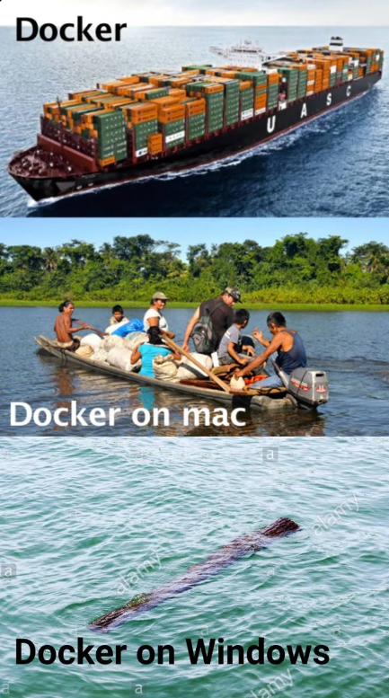

# Part I : Docker basics

**Partie introduction**, avec install de Docker et quelques `docker run`.

## Sommaire

- [Part I : Docker basics](#part-i--docker-basics)
  - [Sommaire](#sommaire)
  - [1. Install](#1-install)
  - [2. Vérifier l'install](#2-vérifier-linstall)
  - [3. Lancement de conteneurs](#3-lancement-de-conteneurs)

## 1. Install

🌞 **Installer Docker votre machine Azure**

- en suivant [la doc officielle](https://docs.docker.com/engine/install/)
- démarrer le service `docker` avec une commande `systemctl`
- ajouter votre utilisateur au groupe `docker`
  - cela permet d'utiliser Docker sans avoir besoin de l'identité de `root`
  - avec la commande : `sudo usermod -aG docker $(whoami)`
  - déconnectez-vous puis relancez une session pour que le changement prenne effet

> N'oubliez pas que je veux **toutes** les commandes dans le compte-rendu dès qu'il y a un p'tit 🌞.



## 2. Vérifier l'install

➜ **Vérifiez que Docker est actif est disponible en essayant quelques commandes usuelles :**

```bash
# Info sur l'install actuelle de Docker
$ docker info

# Liste des conteneurs actifs
$ docker ps
# Liste de tous les conteneurs
$ docker ps -a

# Liste des images disponibles localement
$ docker images

# Lancer un conteneur debian
$ docker run debian

# -d sert à mettre un conteneur en tâche de fond (-d pour daemon)
$ docker run -d debian sleep 99999

# à l'inverse, -it sert à avoir un shell interactif (incompatible avec -d)
$ docker run -it debian bash

# Consulter les logs d'un conteneur
$ docker ps # on repère l'ID/le nom du conteneur voulu
$ docker logs <ID_OR_NAME>
$ docker logs -f <ID_OR_NAME> # suit l'arrivée des logs en temps réel

# Exécuter un processus dans un conteneur actif
$ docker ps # on repère l'ID/le nom du conteneur voulu
$ docker exec <ID_OR_NAME> <COMMAND>
$ docker exec <ID_OR_NAME> ls
$ docker exec -it <ID_OR_NAME> bash # permet de récupérer un shell bash dans le conteneur ciblé

# supprimer un conteneur donné
$ docker rm <ID_OR_NAME>
# supprimer un conteneur donné, même s'il est allumé
$ docker rm -f <ID_OR_NAME>
```

➜ **Explorer un peu le help**, ou le man :

```bash
$ docker --help
$ docker run --help
$ man docker
```

## 3. Lancement de conteneurs

La commande pour lancer des conteneurs est `docker run`.

Certaines options sont très souvent utilisées :

```bash
# L'option --name permet de définir un nom pour le conteneur
$ docker run --name web nginx

# L'option -d permet de lancer un conteneur en tâche de fond
$ docker run --name web -d nginx

# L'option -v permet de partager un dossier/un fichier entre l'hôte et le conteneur
$ docker run --name web -d -v /path/to/html:/usr/share/nginx/html nginx

# L'option -p permet de partager un port entre l'hôte et le conteneur
$ docker run --name web -d -v /path/to/html:/usr/share/nginx/html -p 8888:80 nginx
# Dans l'exemple ci-dessus, le port 8888 de l'hôte est partagé vers le port 80 du conteneur
```

🌞 **Utiliser la commande `docker run`**

- lancer un conteneur `nginx`
  - conf par défaut étou étou, simple pour le moment
  - par défaut il écoute sur le port 80 et propose une page d'accueil
- le conteneur doit être lancé avec un partage de port
  - le port 9999 de la machine hôte doit rediriger vers le port 80 du conteneur

🌞 **Rendre le service dispo sur internet**

- il faut peut-être ouvrir un port firewall dans votre VM (suivant votre OS, ptet y'en a un, ptet pas)
- il faut ouvrir un port dans l'interface web de Azure (appelez moi si vous trouvez pas)
- vous devez pouvoir le visiter avec votre navigateur (un `curl` m'ira bien pour le compte-rendu)

🌞 **Custom un peu le lancement du conteneur**

- l'app NGINX doit avoir un fichier de conf personnalisé pour écouter sur le port 7777 (pas le port 80 par défaut)
- l'app NGINX doit servir un fichier `index.html` personnalisé (pas le site par défaut)
- l'application doit être joignable grâce à un partage de ports (vers le port 7777)
- vous limiterez l'utilisation de la RAM du conteneur à 512M
- le conteneur devra avoir un nom : `meow`

> Tout se fait avec des options de la commande `docker run`.

Petit rappel de fonctionnement sur l'application NGINX :

- le fichier de conf par défaut se trouve dans `/etc/nginx/nginx.conf`
- si vous ouvrez ce fichier, vous constaterez qu'il inclut tout ce qu'il y a dans `/etc/nginx/conf.d`
  - pour que les fichiers de ce dossier soient inclus, ils doivent porter l'extension `.conf`
- il "suffit" donc
  - de créer un fichier de conf NGINX sur l'hôte
    - il porte l'extension `.conf`
    - il comporte une conf minimale pour écouter sur un port et servir un site dans un dossier précis
  - grâce à une option `-v ...` sur le `docker run`
    - de poser votre fichier de conf dans `/etc/nginx/conf.d/`
- un fichier de conf NGINX minimal pour faire ça est aussi simple que :

```nginx
server {
  # on définit le port où NGINX écoute dans le conteneur
  listen 7777;
  
  # on définit le chemin vers la racine web
  # dans ce dossier doit se trouver un fichier index.html
  root /var/www/tp_docker; 
}
```

🌞 **Call me**

- appelez-moi que je visite votre site web please
- envoyez moi l'IP publique par MP Discord (hésitez pas à me faire signe si je suis en train de voguer entre les tables)


