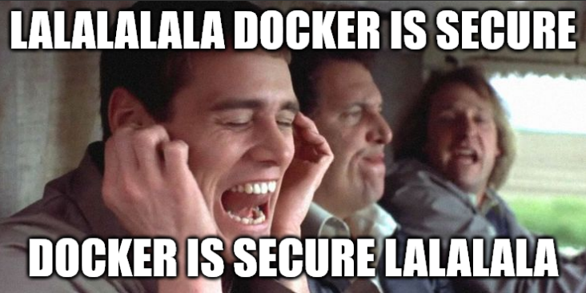

# Part IV : Docker security

Dans cette partie, on va survoler quelques aspects de Docker en terme de sécurité.

## Sommaire

- [Part IV : Docker security](#part-iv--docker-security)
  - [Sommaire](#sommaire)
  - [1. Le groupe docker](#1-le-groupe-docker)
  - [2. Scan de vuln](#2-scan-de-vuln)
  - [3. Petit benchmark secu](#3-petit-benchmark-secu)

## 1. Le groupe docker

Si vous avez correctement ajouté votre utilisateur au groupe `docker`, vous utilisez normalement Docker sans taper aucune commande `sudo`.

> La raison technique à ça c'est que vous communiquez avec Docker en utilisant le socket `/var/run/docker.sock`. Demandez-moi si vous voulez + de détails sur ça.

Cela découle sur le fait que vous avez les droits `root` sur la machine. Sans utiliser aucune commande `sudo`, sans devenir `root`, sans même connaître son mot de passe ni rien, si vous êtes membres du groupe `docker` vous pouvez devenir `root` sur la machine.

🌞 **Prouvez que vous pouvez devenir `root`**

- en étant membre du groupe `docker`
- sans taper aucune commande `sudo` ou `su` ou ce genre de choses
- normalement, une seule commande `docker run` suffit
- pour prouver que vous êtes `root`, plein de moyens possibles
  - par exemple un `cat /etc/shadow` qui contient les hash des mots de passe de la machine hôte
  - normalement, seul `root` peut le faire

## 2. Scan de vuln

Il existe des outils dédiés au scan de vulnérabilités dans des images Docker.

C'est le cas de [Trivy](https://github.com/aquasecurity/trivy) par exemple.

🌞 **Utilisez Trivy**

- effectuez un scan de vulnérabilités sur des images précédemment mises en oeuvre :
  - celle de WikiJS que vous avez build
  - celle de sa base de données
  - l'image de Apache que vous avez build
  - l'image de NGINX officielle utilisée dans la première partie

## 3. Petit benchmark secu

Il existe plusieurs référentiels pour sécuriser une machine donnée qui utilise un OS donné. Un savoir particulièrement recherché pour renforcer la sécurité des serveurs surtout.

Un des référentiels réputé et disponible en libre accès, ce sont [les benchmarks de CIS](https://www.cisecurity.org/cis-benchmarks). Ce sont ni plus ni moins que des guides complets pour sécuriser de façon assez forte une machine qui tourne par exemple sous Debian, Rocky Linux ou bien d'autres.

[Docker développe un petit outil](https://github.com/docker/docker-bench-security) qui permet de vérifier si votre utilisation de Docker est compatible avec les recommandations de CIS.

🌞 **Utilisez l'outil Docker Bench for Security**

- rien à me mettre en rendu, je vous laisse exprimer votre curiosité quant aux résultats
- ce genre d'outils est cool d'un point de vue pédagogique : chaque check que fait le script c'est un truc à savoir finalement !

