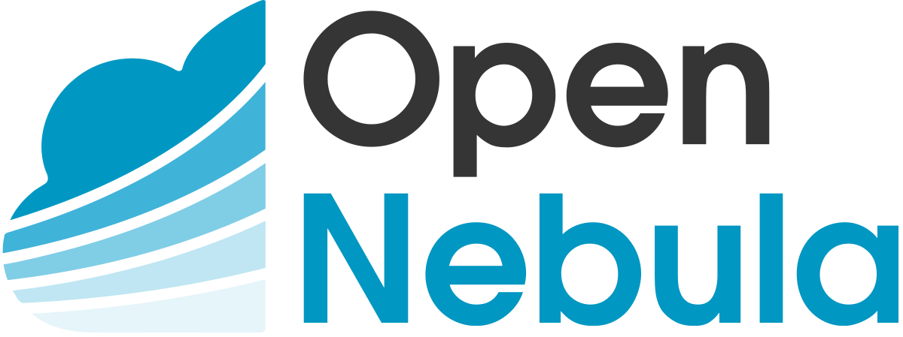
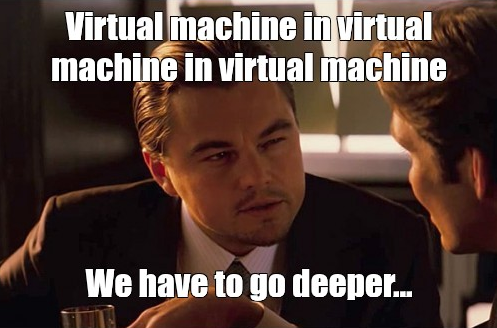
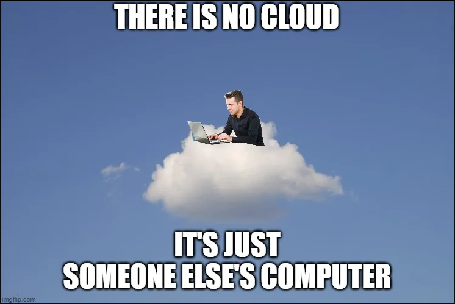

# TP3 : Self-hosted private cloud platform

Dans ce TP, **on déploie notre propre plateforme de cloud privé.**

**L'idée est d'arriver à proposer des fonctionnalités similaires à ce que peut proposer Azure ou AWS.** Bien sûr, on restera dans un setup simpliste, et on sera (très) loin de proposer des choses aussi intégrées que AWS ou Azure.

Le but ici est de mettre en place une plateforme extensible permettant de créer des VMs : on veut un outil qui permet de créer des VMs "à volonté", en se basant sur plusieurs hyperviseurs.

Tout ce qui est de l'ordre **la virtualisation, du stockage, et du réseau doivent être complètement abstraits** : on veut faire 3 clics et ça crée 10 VMs.

> *On va faire ça sur vos postes, donc c'est un TP qui nécessite au minimum de minimum 8Go de RAM. Les gars on va pas se le cacher, monter une plateforme cloud ça se fait pas avec un château de sable.*

---

**L'outil qu'on va utiliser pour setup tout ça c'est Open Nebula.** Parce que c'est libre et open source, et parce que je l'aime bien. Y'aurait aussi OpenStack, plus réputé, mais c'est beaucoup moins KISS (Keep It Simple Stupid), et donc forcément, ça tourne genre pas trop sur nos ptits PCs.



Open Nebula, il repose sur des trucs super **standards** pour tout faire :

- côté hyperviseurs, on va utiliser **KVM**
- côté réseau, ça va être du **bridge Linux + un peu de FirewallD + du VXLAN**
- côté stockage, on va rester simple avec du stockage local
- pour la communication entre les noeuds, c'est du **SSH**

## Sommaire

- [TP3 : Self-hosted private cloud platform](#tp3--self-hosted-private-cloud-platform)
  - [Sommaire](#sommaire)
- [0. Prérequis](#0-prérequis)
- [I. Présentation du lab](#i-présentation-du-lab)
  - [1. Architecture](#1-architecture)
  - [2. Noeud Frontend](#2-noeud-frontend)
  - [3. Noeuds KVM](#3-noeuds-kvm)
- [II. Setup](#ii-setup)
  - [1. Frontend](#1-frontend)
  - [2. Noeuds KVM](#2-noeuds-kvm)
  - [3. Réseau](#3-réseau)
- [III. Utiliser la plateforme](#iii-utiliser-la-plateforme)
- [IV. Ajouter d'un noeud et VXLAN](#iv-ajouter-dun-noeud-et-vxlan)

# 0. Prérequis

➜ **VM Rocky prête à être clonée**

- en local dans votre VBox
- on va avoir besoin de 3 machines :
  - une VM avec 
    - au moins 2G de RAM (3/4 conseillé) et 1 CPU
    - un accès à internet + accès à un LAN avec les autres VMs
  - deux autres VMs avec 
    - au moins 2G de RAM (4/6/8 conseillés) et 1 (ou 2) CPUs
    - un accès à internet + accès à un LAN avec les autres VMs
- ptite préparation must-have sur toutes les VMs :


```bash
# update de tout le système
dnf update -y

# ajout de paquets utiles, n'hésitez pas à ajouter les vôtres
dnf install -y vim

# désactivation de SELinux
sed -i 's/SELINUX=enforcing/SELINUX=permissive/' /etc/selinux/config
setenforce 0
```

➜ **Activer la Nested virtu sur les deux VMs identiques**

"Nested virtualization" ça désigne le fait de faire une VM dans une VM. Bah ouais, le but de la plateforme qu'on va monter, c'est de lancer des VMs, et on va tester ça dans des VMs.

Il y a une option dans les settings de VirtualBox pour chaque VM : `Nested VT-x/AMD-V` en anglais.



➜ Ce TP n'est **qu'une paraphrase gigantesque de [la doc officielle](https://docs.opennebula.io/6.10/)**

➜ **Comprendre un minimum le fonctionnement/l'architecture de OpenNebula** avant de commencer, la doc explique plutôt bien en intro ! Ou écoutez moi en cours sinon :d


# I. Présentation du lab

## 1. Architecture

| Node           | IP Address  | Rôle                         |
|----------------|-------------|------------------------------|
| `frontend.one` | `10.3.1.10` | WebUI OpenNebula             |
| `kvm1.one`     | `10.3.1.11` | Hyperviseur + Endpoint VXLAN |
| `kvm2.one`     | `10.3.1.12` | Hyperviseur + Endpoint VXLAN |

🌞 **Allumez les VMs et effectuez la conf élémentaire :**

- adresse IP statique
- définition du nom de domaine avec `hostnamectl`
- vous remplirez les fichiers `/etc/hosts` des trois machines pour qu'elles se joignent avec leurs noms
- pour le compte-rendu, j'veux juste :
  - `ping kvm1.one` depuis `frontend.one`
  - `ping kvm2.one` depuis `frontend.one`

> Je vous recommande de n'utiliser que les noms des VMs plutôt que leurs IP pour le reste du TP. Il pourrait être malin d'ajouter aussi leurs adresses IP au fichier `hosts` de votre PC ;)

## 2. Noeud Frontend

Le noeud `frontend.one` expose une interface Web sexy (oupa?) qui permet de contrôler la plateforme.

C'est depuis là qu'on fera nos premiers pas pour :

- créer un réseau
- télécharger des templates de VMs
- ajouter des noeuds de virtu au cluster (nos noeuds KVM)
- et surtout, créer des VMs !

## 3. Noeuds KVM

Les noeuds `kvm1.one` et `kvm2.one` sont des VMs avec qemu/KVM installés, qui à deux, forment l'hyperviseur natif qu'on utilise sur des systèmes Linux.

> On parle souvent juste de "hyperviseur KVM" bien que qemu soit systématiquement présent dans le mix.

Pour contrôler des VMs KVM, il faut utiliser le démon `libvirtd`. Une fois qu'il est démarré, on peut l'utiliser pour gérer des VMs.

> On ne l'utilisera pas nous-mêmes dans ce TP : c'est OpenNebula qui s'en servira pour créer des VMs.

L'idée ici, dans le contexte du TP, c'est de préparer deux VMs avec l'hyperviseur KVM installé, et on permettra au noeud `frontend.one` de s'y connecter en SSH pour gérer des VMs.

> Ui, OpenNebula repose sur SSH. Simpliste, mais surtout standard et robuste !

# II. Setup

## 1. Frontend

Le noeud `frontend.one` va héberger la logique de l'application, et exposer la WebUI ainsi que l'API.

➜ **J'ai fait [un doc dédié pour le setup du frontend](./frontend.md), déroulez-le en entier sur la machine `frontend.one` avant de continuer.**

## 2. Noeuds KVM

Le noeud `kvm1.one` va héberger un hyperviseur KVM. Il sera contrôlé par `frontend.one` (à travers SSH).

➜ **J'ai fait [un doc dédié pour le setup des noeuds KVM](./kvm.md), déroulez-le en entier, uniquement sur la machine `kvm1.one`, avant de continuer.**

> On configurera `kvm2.one` plus tard !

## 3. Réseau

On va créer un réseau VXLAN pour que les VMs pourront utiliser pour communiquer.

➜ **Pouif, là encore, j'ai fait [un doc dédié pour le setup du réseau](./network.md), déroulez-le en entier, avant de continuer.**

- les commandes ne sont à effectuer que `kvm1.one`
- le setup de `kvm2.one` ne viendra que dans la partie IV du TP

# III. Utiliser la plateforme

Bah ouais il serait temps nan. Pop des ptites VMs.

OpenNebula fournit des images toutes prêtes, ready-to-use, qu'on peut lancer au sein de notre plateforme Cloud.

➜ **RDV de nouveau sur la WebUI de OpenNebula, et naviguez dans `Settings > Onglet Auth`**

- OpenNebula a généré une paire de clé sur la machine `frontend.one`
- elle se trouve dans le dossier `.ssh` dans le homedir de l'utilisateur `oneadmin`
- déposez la clé publique dans cet interface de la WebUI

> *Dans un cas réel, on poserait clairement une autre clé, la nôtre. On pourrait aussi en déposer plusieurs, s'il y a plusieurs admins dans la boîte. Ca pourrait se faire avec une image custom et du `cloud-init` par exemple. Là on fait ça comme ça, pour pas vous brainfuck avec 14 clés différentes. Appelez-moi pour un setup propre si vous voulez.*

➜ **Toujours sur la WebUI de OpenNebula, naviguez dans `Storage > Apps`**

Récupérez l'image de Rocky Linux 9 dans cette interface.

> Les images proposées par les gars d'OpenNebula, on peut s'y connecter qu'en SSH, il faudra donc pouvoir les joindre niveau IP pour les utiliser.

➜ **Toujouuuuurs sur la WebUI de OpenNebula, naviguez dans `Instances > VMs`**

- créez votre première VM :
  - doit utiliser l'image Rocky Linux 9 qu'on a créé précédemment
  - doit utiliser le virtual network créé précédemment

➜ **Tester la connectivité à la VM**

- déjà est-ce qu'on peut la ping ?
  - depuis le noeud `kvm1.one`, faites un `ping` vers l'IP de la VM
  - l'IP de la VM est visible dans la WebUI
- pour pouvoir se co en SSH, il faut utiliser la clé de `oneadmin`, suivez le guide :

```bash
# connectez vous en SSH sur la machine frontend.one

# devenez l'utilisateur oneadmin
[it4@frontend ~]$ sudo su - oneadmin

# lancez un agent SSH (demandez-moi si vous voulez une explication sur ça)
[oneadmin@frontend ~]$ eval $(ssh-agent)

# ajoutez la clé privée à l'agent SSH
[oneadmin@frontend ~]$ ssh-add
Identity added: /var/lib/one/.ssh/id_rsa (oneadmin@frontend)

# rebondir sur kvm1 pour se connecter à la VM qui a l'IP 10.220.220.100
[oneadmin@frontend ~]$ ssh -J kvm1 root@10.220.220.100

# on est co dans la VM
[root@localhost ~]# 
```

➜ **Si vous avez bien un shell dans la VM, vous êtes au bout des péripéties, pour un setup basique !**

- vous pouvez éventuellement ajouter l'IP de la machine hôte comme route par défaut pour avoir internet (l'IP du bridge VXLAN de l'hôte) :

```bash
[root@localhost ~]# ip route add default via 10.220.220.201
[root@localhost ~]# ping 1.1.1.1
```

# IV. Ajouter d'un noeud et VXLAN

➜ [**Et l'dernier ! Doc dédié à la partie IV.**](./kvm2.md)


