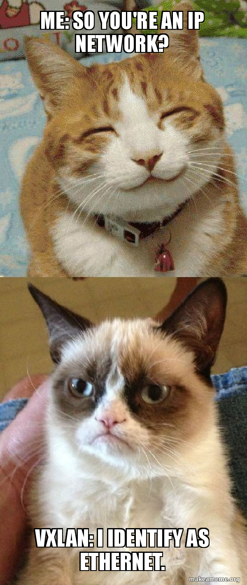

# IV. Ajout d'un noeud et VXLAN

Dernière partie : on configure `kvm2.one` et on teste les fonctionnalités réseau VXLAN : deux VMs sur des hyperviseurs différents se `ping` comme si elles étaient dans le même LAN !

## Sommaire

- [IV. Ajout d'un noeud et VXLAN](#iv-ajout-dun-noeud-et-vxlan)
  - [Sommaire](#sommaire)
  - [1. Ajout d'un noeud](#1-ajout-dun-noeud)
  - [2. VM sur le deuxième noeud](#2-vm-sur-le-deuxième-noeud)
  - [3. Connectivité entre les VMs](#3-connectivité-entre-les-vms)
  - [4. Inspection du trafic](#4-inspection-du-trafic)

## 1. Ajout d'un noeud

🌞 **Setup de `kvm2.one`, à l'identique de `kvm1.one`** excepté :

- une autre IP statique bien sûr
- idem, pour le bridge, donnez-lui l'IP `10.220.220.202/24` (celle qui est juste après l'IP du bridge de `kvm1`)
- une fois setup, ajoutez le dans la WebUI, dans `Infrastructure > Hosts`

## 2. VM sur le deuxième noeud

🌞 **Lancer une deuxième VM**

- vous pouvez la forcer à tourner sur `kvm2.one` lors de sa création
- mettez la dans le même réseau que le premier `kvm1.one`
- assurez-vous que vous pouvez vous y connecter en SSH

## 3. Connectivité entre les VMs

🌞 **Les deux VMs doivent pouvoir se ping**

- alors qu'elles sont sur des hyperviseurs différents, elles se ping comme si elles étaient dans le même réseau local !

## 4. Inspection du trafic

🌞 **Téléchargez `tcpdump` sur l'un des noeuds KVM**

- effectuez deux captures, pendant que les VMs sont en train de se ping :
  - **une qui capture le trafic de l'interface réelle** : `eth1` probablement (celle qui a l'IP host-only, celle qui porte `10.3.1.22` sur `kvm2` par exemple)
  - **une autre qui capture le trafic de l'interface bridge VXLAN**
    - on l'a appelée `vxlan-bridge` dans le TP
- petit rappel d'une commande `tcpdump` :

```bash
# capturer le trafic de eth1, et l'enregistrer dans un fichier yo.pcap
tcpdump -i eth1 -w yo.pcap
```

➜ **Analysez les deux captures**

- dans la capture de `eth1` vous devriez juste voir du trafic UDP entre les deux noeuds
  - si vous regardez bien, vous devriez que ce trafic UDP contient lui-même des trames
- dans la capture de `vxlan-bridge`, vous devriez voir les "vraies" trames échangées par les deux VMs


